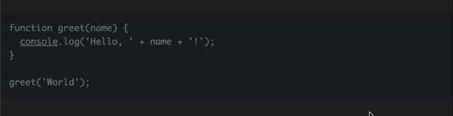

# Shakyo

Shakyo is a typing practice application that allows users to practice typing code with syntax highlighting. Users can select a programming language, paste their code, and practice typing with visual feedback.

## Features

- Syntax highlighting for multiple programming languages
- Real-time typing feedback
- Language selection
- Customizable code input

## Usage

1. Open the application in your browser at [https://shakyo.erbowl.com/](https://shakyo.erbowl.com/).
2. Select the programming language from the dropdown menu.
3. Paste your code into the textarea.
4. Start typing to practice.

## Contributing

Contributions are welcome! Please open an issue or submit a pull request.

## License

This project is licensed under the MIT License.
